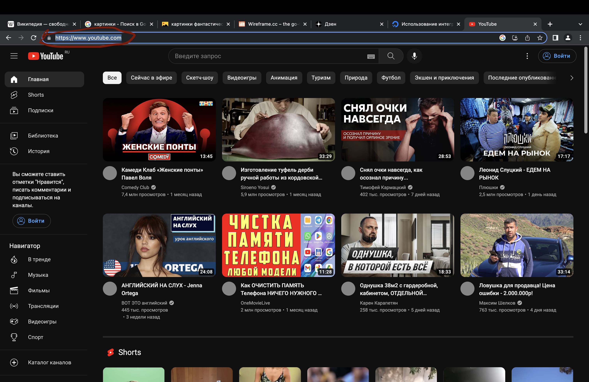
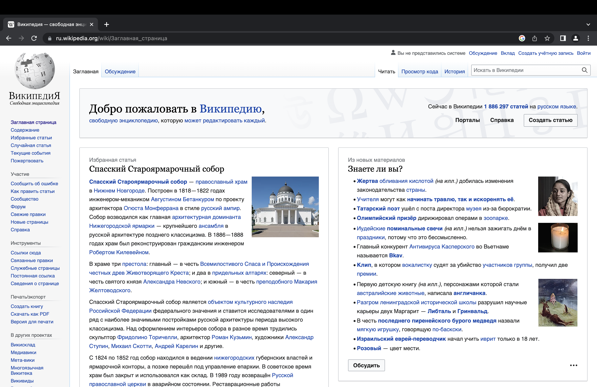
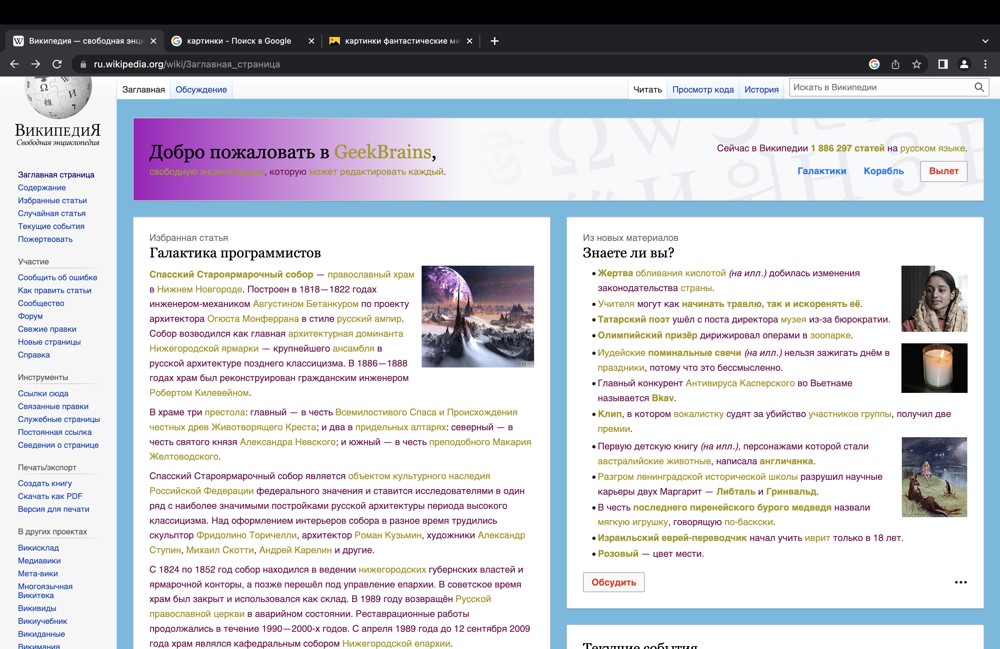
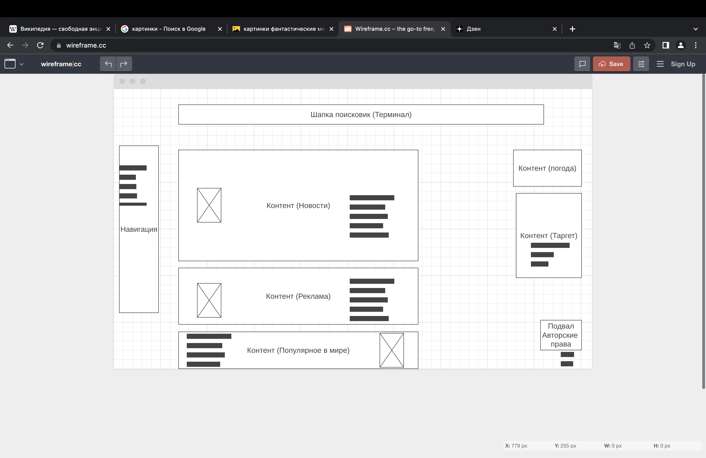

## 1. Определите, на каком протоколе работает сайт youtube.com.

 ### Сделайте скриншот с названием 1_protocol.jpg, по которому станет понятно, как вы определили протокол сайта.

 # Ответ:
 ### 1. Сайт Ютуб работает на протоколе https://www.youtube.com/
 ### 2. Скриншот
 

 ## 2. Создайте файл 2_analyze.txt, в котором проанализируйте структуру страницы сайта https://ru.wikipedia.org/, а именно нужно описать (коротко, своими словами), какие блоки есть на сайте, что в этих блоках находится. Есть ли на сайте шапка, подвал, что в них содержится? Как и где расположен контент? Есть ли дополнительные элементы на странице?
 # Ответ:
 ### Решил не создавать файл 2_analyze.txt, показалось так удобнее.
 ### Страница работает на протоколе https://
 ### По блокам:
 ### Имеется вверху шапка с навигацией, ниже шапка с приветствием деленная на две графы.
 ### Под "Шапками находится блок с "контентом" или описанием заданного элемента, также разделенный на несколько блоков разного содержания одной тематики.
 ### С боку блоки с навигацией или содержанием меню сайта. 
 ### В самом низу находится подвал с описанием прав и лицензии, указанием разработчиков сайта.
 ### Над "подвалом" находится реклама и ссылки своих партнеров организаций с кем сорудничают.
 ### В кратце думаю на этом все, если правильно понял задание. =)
 ## 3. Внесите не менее 10 изменений на страницу любой статьи сайта https://ru.wikipedia.org/, с помощью инструмента разработчика и представьте два скриншота было/стало (скриншоты должны иметь названия 3_before.jpg, 3_after.jpg соответственно). Желательно поработать с изменением текста на странице, заменой картинки, изменением стилей.
 ## Ответ:
 
 
 ### Стиль сменил, картинку сменил, текст сменил.
 ## 4. Создайте прототип низкой детализации сайта https://dzen.ru/ с помощью сайта https://wireframe.cc/. Предоставьте скриншот того, что получилось (скриншот должен быть назван 4_proto.jpg).
 # Ответ:
 
 ### Прототип создан. Надеюсь правильно. 
 # Спасибо за внимание!